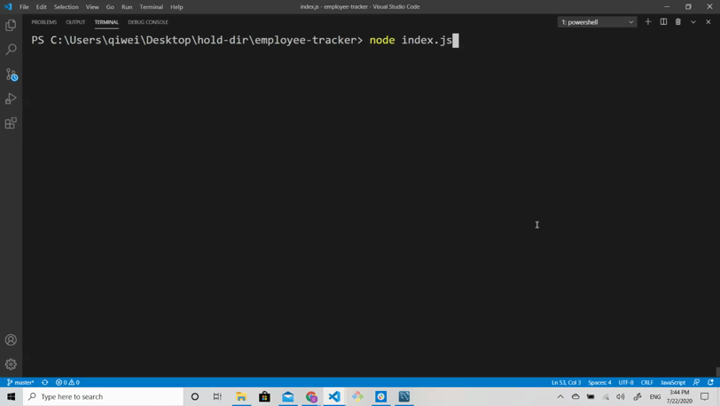

# Employee Tracker

[](https://github.com/dwyl/esta/issues)


## Description
The Employee Tracker is a node.js based command line application connected to a SQL database. This CMS allows for the user to complete a variety of employee management related tasks - from viewing employees, to updating roles, and even removing content.

## Table of Contents
* [Background](#background)
* [Approach](#approach)
* [Tools](#tools)
* [Installation](#installation)
* [Usage](#usage)
* [License](#license)
* [Contributing](#contributing)
* [Tests](#tests)
* [Questions](#questions)
* [Authors](#authors)

## Background
The objective of this exercise was to build an employee management CMS. All components were built from scratch - from creation of the SQL database to the command line application.

Acceptance criteria is as follows:

```
  * Add departments, roles, employees

  * View departments, roles, employees

  * Update employee roles

  * Update employee managers

  * View employees by manager

  * Delete departments, roles, and employees

  * View the total utilized budget of a department 

```

## Approach
This project featured a few areas which required specific focus:
1) Creating the SQL database and accessing data
2) Leveraging the inquirer NPM to capture user inputs

### Creating and accessing the SQL database
The database consists of three tables with foreign keys linking the three tables. Below is an example of the employee table which contains both a foreign key referencing the role table and a self referencing foreign key which references the employee id field.
```
CREATE TABLE employee (
    id INT (11) AUTO_INCREMENT,
    first_name VARCHAR(30),
    last_name VARCHAR(30),
    role_id INT,
    manager_id INT DEFAULT(0),
    PRIMARY KEY (id),
    CONSTRAINT fk_role FOREIGN KEY (role_id) REFERENCES role(id) ON DELETE SET NULL,
    CONSTRAINT fk_manager FOREIGN KEY (manager_id) REFERENCES employee(id) ON DELETE SET NULL
);
```
The below example illustrates how data is queried from the SQL database. As you can see below, "INNER JOIN" is used to "link" the contents of the various tables together. The second connection.query is utilized to concatenate the manager's first and last names together before pusing them into a variable. This was done to meet a desired display aesthetic. 
```
function viewEmployeesbyManager(manager) {
    const employeeList = [];
    const employeeManager = [];
    connection.query(`SELECT employee.id, employee.first_name, employee.last_name, role.title, department.department, role.salary
    FROM ((employee
    INNER JOIN role ON employee.role_id = role.id)
    INNER JOIN department ON role.department_id = department.id)
    WHERE employee.manager_id = ${manager};`
        , function (err, res) {
            if (err) throw err;
            for (let i = 0; i < res.length; i++) {
                employeeList.push(res[i])
            }
        });
    connection.query(queryAll2, function (err, res) {
        if (err) throw err;
        for (let j = 0; j < res.length; j++) {
            employeeManager.push(res[j])
        }

        for (let k = 0; k < employeeList.length; k++) {
            for (let l = 0; l < employeeManager.length; l++) {
                if (employeeList[k].id === employeeManager[l].id) {
                    employeeList[k].manager = employeeManager[l].manager
                }
            }
        }
        console.log('\n')
        console.table(employeeList)
        run();
    })
}
```

### Capturing User Inputs
User inputs are captured using the inquirer NPM. A recursive approach is used to bring the user back to the initial starting point after the completion of each action. The below example shows the primary prompt from which the user selects the action he/she wishes to complete. Switch and case are used to iterate through the various choices and define the actions.

```
inquirer.prompt([
        {
            type: "list",
            name: "startPoint",
            message: "What would you like to do?",
            choices: [
                "View employees",
                "View roles",
                "View departments",
                "Add employees",
                "Add roles",
                "Add departments",
                "Update employee roles",
                "Update employee manager",
                "View employees by manager",
                "View the total utilized budget of a department",
                "Delete departments",
                "Delete roles",
                "Remove employees",
                "Exit"
            ]
        }

    ]).then(data => {
        switch (data.startPoint) {
            case "View employees":
                return viewAllEmployees();

            case "View roles":
                return viewRoles();
```

## Tools

* [JS](https://developer.mozilla.org/en-US/docs/Web/JavaScript)
* [jquery](https://jquery.com/)
* [mysql](https://www.mysql.com/)
* [Inquirer](https://www.npmjs.com/package/inquirer#prompt)
* [mysql NPM](https://www.npmjs.com/package/mysql)

## Installation
To install this app, users must download the contents of this repository, excluding the package-lock.json file, onto their local harddrive. Once copied, from terminal, the user must type in 'npm install' to install the required modules for this app to function.

To setup the database, users will need to copy the contents of the employees.sql schema file and run it in MySQL.


## Usage
To use the app, simply type in 'node index.js' from your terminal while in the directory which contains the app.js. Select your desired action to complete and answer a series of questions prompted to you inside your terminal. See below for detailed usage examples.

View demo:

[Video](https://drive.google.com/file/d/1ZZ5GDrSFqYKTNWxcJuSVjVYuYCBtghAb/view)




Add demo:

[Video](https://drive.google.com/file/d/1iOKLXAq7yOlmJ1EqEjkL1Q5oN5_n3KqK/view)


Update and additional views demo:

[Video](https://drive.google.com/file/d/1G6xrjmSgOrbtsJLuqOoboYMDnJ2SelkZ/view)


Delete demo:

[Video](https://drive.google.com/file/d/1KcDzXQ6RilYfnrXOFGOBm1psnduWRNSK/view)


## License
MIT

## Contributing
Contributors are welcome. Please contact for further details.

## Questions
If you have any questions regarding this project, please email me at: qiwei.mod@gmail.com

## Authors

* **CHRISTOPHER LEE** 

- [Link to Github](https://github.com/CofChips)
- [Link to LinkedIn](https://www.linkedin.com/in/christophernlee/)
